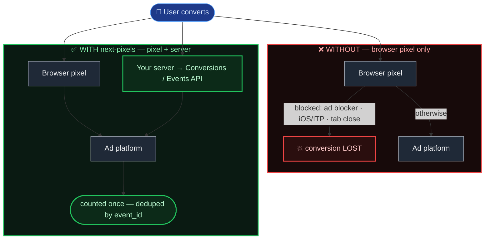
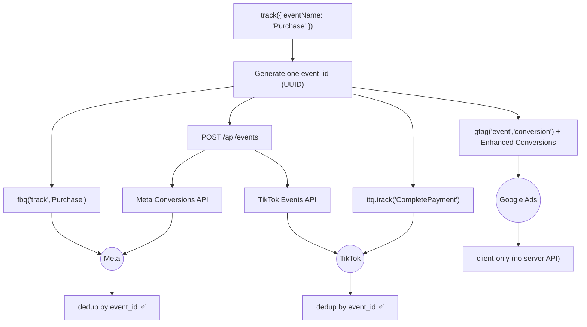

# next-pixels

Facebook, **TikTok**, and **Google Ads** pixels + server-side Conversions / Events API for Next.js App Router.

One `track()` call fires the browser pixel (and the server API where the platform supports it) for every configured provider, with automatic deduplication, PII hashing, and TypeScript support.

## Why this exists

**The problem.** A browser pixel alone (`fbq`, `ttq`) misses a large and growing share of conversions:

- **Ad blockers & tracking protection** drop the pixel script entirely — often 10–30% of traffic.
- **Safari/iOS (ITP)** cap first-party cookie lifetime to ~7 days, so returning users look brand new and attribution breaks.
- **Network flakiness, early tab-close, and CSP** mean client beacons silently never arrive.

Under-reported conversions don't just dent your dashboards — they starve the ad platforms' optimization models, so you pay more for worse targeting.

**The fix the platforms recommend.** Send each event **twice**: once from the browser (pixel) and once from your server (Meta Conversions API / TikTok Events API). The server call runs even when the browser one is blocked, and carries hashed first-party data (email, phone) for stronger matching. To avoid counting the same conversion twice, both hits share one **event ID** that the platform deduplicates on.



The server path has no script to block, so the conversion still lands even when the browser pixel doesn't.

| | Browser pixel only | next-pixels (pixel + server) |
|---|---|---|
| Client blocked (ad blocker / ITP) | ❌ conversion lost | ✅ server still reports it |
| Match quality | cookie only | cookie **+** hashed email/phone |
| Double-counting | — | ✅ deduped by shared `event_id` |
| Adding Meta **and** TikTok | wire each by hand, twice | one `track()` call |

**Why a package.** Wiring that up correctly is fiddly and easy to get subtly wrong — generating and threading a shared ID, hashing PII the way each platform expects (Meta wants digits-only phones, TikTok wants E.164), mapping event names across platforms (`Purchase` ↔ `CompletePayment`), and repeating all of it per provider. `next-pixels` collapses it into a single `track()` call that fans out to every configured provider on both client and server, deduped — so you write the event once and get reliable attribution everywhere.

## Features

- **Multi-provider** — Meta (Facebook), TikTok, and Google Ads from a single `track()` call
- **Pixel + server API** — Dual browser+server tracking for maximum attribution (Meta CAPI + TikTok Events API). Google Ads is client-side via gtag + Enhanced Conversions ([why](#a-note-on-google-ads))
- **Auto-deduplication** — A shared event ID prevents double-counting on each platform
- **Auto event mapping** — Meta event names map to TikTok equivalents (e.g. `Purchase` → `CompletePayment`)
- **PII hashing** — SHA256 hashing of emails, phones, names before sending
- **App Router** — Built for Next.js 13+ App Router with `"use client"` components
- **TypeScript** — Full type safety with exported interfaces
- **Dev mode** — Mock responses and fallback cookies in development
- **Zero dependencies** — Only `next` and `react` as peer deps

## Quick Start

### 1. Install

```bash
npm install next-pixels
```

### 2. Add environment variables

Set the providers you use — each is optional and activates independently.

```bash
# .env.local

# Meta (Facebook)
NEXT_PUBLIC_FB_PIXEL_ID=123456789       # Pixel ID
FB_PIXEL_ACCESS_TOKEN=EAAx...           # CAPI access token (server only)

# TikTok
NEXT_PUBLIC_TIKTOK_PIXEL_ID=D8CNI...    # Pixel / sdkid
TIKTOK_ACCESS_TOKEN=...                 # Events API access token (server only)

# Google Ads (client-side only)
NEXT_PUBLIC_GOOGLE_ADS_ID=AW-123456789  # Conversion ID
NEXT_PUBLIC_GOOGLE_ADS_LABEL=AbC-D_efG  # Default conversion label (optional)
```

### 3. Add to your layout

```tsx
// app/layout.tsx
import { Pixel, PixelPageView } from "next-pixels";

export default function RootLayout({ children }: { children: React.ReactNode }) {
  return (
    <html lang="en">
      <body>
        {children}
        <Pixel />          {/* loads every configured provider's script */}
        <PixelPageView />  {/* PageView on every route change */}
      </body>
    </html>
  );
}
```

`<Pixel />` renders only the providers whose env vars are set. Prefer per-provider control? Use `<FacebookPixel />` and `<TikTokPixel />` directly.

### 4. Create the API route (for server-side forwarding)

```ts
// app/api/events/route.ts
import { eventsHandler } from "next-pixels/handlers";
export const POST = eventsHandler;
```

### 5. Track events

```tsx
import { track } from "next-pixels";

// Fires Meta "Lead" + TikTok "SubmitForm", deduped, client + server
track({ eventName: "Lead" });

// With data + PII for better server-side matching
track({
  eventName: "Purchase",                 // Meta name; mapped to TikTok "CompletePayment"
  data: { value: 29.99, currency: "USD" },
  emails: ["user@example.com"],
  phones: ["+972501234567"],
});
```

## How multi-provider tracking works

When you call `track()`:

1. A unique `eventId` (UUID v4) is generated.
2. The client fires each loaded pixel with that id:
   - Meta: `fbq('track', 'Purchase', { eventID })`
   - TikTok: `ttq.track('CompletePayment', {...}, { event_id })`
3. A single POST to `/api/events` forwards the event to each configured server API:
   - Meta Conversions API (`event_id`)
   - TikTok Events API (`event_id`)
4. Each platform matches its client + server events by id and counts them once.



The event-name map (`Purchase` → `CompletePayment`, `Lead` → `SubmitForm`, etc.) is applied automatically. Override per call with `tiktokEventName`, or read/extend the map via the exported `META_TO_TIKTOK_EVENTS` / `toTikTokEventName`.

## API Reference

### Components

#### `<Pixel />`

Loads the script for every configured provider. Add once in your root layout.

#### `<FacebookPixel />` / `<TikTokPixel />` / `<GoogleAds />`

Load a single provider's pixel. Each renders nothing if its env var (`NEXT_PUBLIC_FB_PIXEL_ID` / `NEXT_PUBLIC_TIKTOK_PIXEL_ID` / `NEXT_PUBLIC_GOOGLE_ADS_ID`) is unset.

#### `<PixelPageView />`

Tracks `PageView` on every route change, across all configured providers.

### Client Functions

#### `track(options)`

Track an event on every configured provider — client pixel + server API.

```ts
track({
  eventName: "Purchase",          // Required — Meta-style name, mapped to TikTok
  data: {                         // Optional — event parameters (value, currency, ...)
    value: 29.99,
    currency: "USD",
  },
  emails: ["user@example.com"],   // Optional — hashed, sent server-side
  phones: ["+1234567890"],        // Optional — hashed, sent server-side
  firstName: "John",              // Optional
  lastName: "Doe",                // Optional
  tiktokEventName: "ViewContent", // Optional — explicit TikTok name (overrides the map)
  googleLabel: "AbC-D_efG",       // Optional — Google Ads conversion label for this event
  apiRoute: "/api/events",        // Optional — default: "/api/events"
});
```

`fbEvent(options)` is a deprecated alias for `track` (same signature), kept for backward compatibility.

**Google Ads conversion labels.** Google needs a distinct label per conversion action. Register a map once (e.g. in your layout) so `track()` knows which label each event uses:

```ts
import { setGoogleConversionLabels } from "next-pixels";

setGoogleConversionLabels({
  Purchase: "AbC-D_efG",
  Lead: "XyZ-1_2345",
});
```

Resolution order per event: `googleLabel` option → registered map → `NEXT_PUBLIC_GOOGLE_ADS_LABEL`. If none resolves, the Google conversion is skipped (with a dev warning) while Meta/TikTok still fire.

#### `usePixel()`

React hook wrapper for `track`.

```tsx
const { track } = usePixel();
track({ eventName: "AddToCart", data: { value: 19.99 } });
```

#### Low-level per-provider helpers

- `trackStandardEvent(name, options?, eventID?)` — `fbq('track', ...)` only
- `trackCustomEvent(name, options, eventID)` — `fbq('trackCustom', ...)` only
- `trackTikTokEvent(name, options?, eventID?, tiktokNameOverride?)` — `ttq.track(...)` only
- `trackGoogleAdsConversion(name, options?, eventID?, label?, userData?)` — `gtag('event','conversion')` only
- `trackPageView(...)` / `trackTikTokPageView()` / `trackGoogleAdsPageView()` — per-provider PageView
- `isPixelInitialized()` / `isTikTokInitialized()` / `isGoogleAdsInitialized()` — script-loaded checks

### Event name mapping

```ts
import { META_TO_TIKTOK_EVENTS, toTikTokEventName } from "next-pixels";

toTikTokEventName("Purchase");            // "CompletePayment"
toTikTokEventName("MyCustom");            // "MyCustom" (passthrough)
toTikTokEventName("Lead", "ViewContent"); // "ViewContent" (override)
```

Standard events: Meta — `Lead`, `Purchase`, `AddToCart`, `InitiateCheckout`, `ViewContent`, `CompleteRegistration`, `Subscribe`, `Search`. TikTok — `CompletePayment`, `SubmitForm`, `AddToCart`, `InitiateCheckout`, `ViewContent`, `CompleteRegistration`, `Subscribe`, `Search`, `PlaceAnOrder`, `Contact`.

### Server Functions

#### `sendServerEvent(eventData)`

Forward an event to every configured provider's server API. Returns a per-provider result object: `{ meta?: {...}, tiktok?: {...} }`. Use for server-side events (API routes, Server Actions).

```ts
import { sendServerEvent } from "next-pixels/server";

const result = await sendServerEvent({
  eventName: "Lead",
  eventId: "unique-uuid",
  emails: ["user@example.com"],
  sourceUrl: "https://example.com/form",
});
// result -> { meta: { ok: true, result }, tiktok: { ok: true, result } }
```

Per-provider helpers are also exported: `sendMetaServerEvent`, `sendTikTokServerEvent`, plus `isMetaConfigured()` / `isTikTokConfigured()`.

> Google Ads has no server-side call here — it's client-only (see [the note below](#a-note-on-google-ads)), so `sendServerEvent` only ever forwards to Meta and TikTok.

### Handler

#### `eventsHandler`

Pre-built Next.js POST handler that fans out to all configured providers.

```ts
// app/api/events/route.ts
import { eventsHandler } from "next-pixels/handlers";
export const POST = eventsHandler;
```

`fbEventsHandler` remains exported as a deprecated alias.

## Environment Variables

| Variable | Required | Side | Description |
|---|---|---|---|
| `NEXT_PUBLIC_FB_PIXEL_ID` | For Meta | Client + Server | Facebook Pixel ID |
| `FB_PIXEL_ACCESS_TOKEN` | For Meta CAPI | Server only | Meta [System User access token](https://developers.facebook.com/docs/marketing-api/conversions-api/get-started/#access-token) |
| `NEXT_PUBLIC_TIKTOK_PIXEL_ID` | For TikTok | Client + Server | TikTok Pixel ID / sdkid |
| `TIKTOK_ACCESS_TOKEN` | For TikTok Events API | Server only | TikTok [Events API access token](https://business-api.tiktok.com/portal/docs?id=1771101027431426) |
| `NEXT_PUBLIC_GOOGLE_ADS_ID` | For Google Ads | Client only | Google Ads conversion ID (`AW-XXXXXXXXX`) |
| `NEXT_PUBLIC_GOOGLE_ADS_LABEL` | No | Client only | Default Google Ads conversion label (per-event labels via `setGoogleConversionLabels`) |
| `FB_TEST_EVENT_CODE` | No | Server only | Meta test event code for development |

A provider activates only when its `NEXT_PUBLIC_*` ID is set — so this package works with any subset: Meta only, TikTok only, Google only, or all together.

### A note on Google Ads

Meta and TikTok expose a simple server endpoint (Conversions / Events API) that this package calls with an access token — that's the dual client+server dedup story. **Google Ads is different:**

- Its server-side conversions require the full **Google Ads API** (OAuth2 + developer token + customer ID), not a token-in-env fetch — out of scope here.
- Its analytics server path (GA4 Measurement Protocol) is a *separate* stream that would **double-count** if fired alongside the browser tag.

So for Google, `next-pixels` fires the **browser tag only** (`gtag`), and attaches hashed **Enhanced Conversions** data (email/phone) to recover most of the match-quality a server call would add. `transaction_id` carries the shared event id for Google's own dedup. No `/api/events` call is made for Google.

## Getting your credentials

New to pixels? Here's where each value comes from. You only need credentials for the provider(s) you actually use.

### Meta (Facebook)

1. **Pixel ID** → open [Meta Events Manager](https://business.facebook.com/events_manager2), create (or select) a Data Source of type **Web**. The numeric **Pixel ID** shown there is your `NEXT_PUBLIC_FB_PIXEL_ID`.
2. **Conversions API access token** → in Events Manager, open your pixel → **Settings** → **Conversions API** → **Generate access token**. That value is `FB_PIXEL_ACCESS_TOKEN` (keep it server-side only).
3. Docs: [Meta Pixel — get started](https://developers.facebook.com/docs/meta-pixel/get-started) · [Conversions API — get started](https://developers.facebook.com/docs/marketing-api/conversions-api/get-started) (incl. the [access token](https://developers.facebook.com/docs/marketing-api/conversions-api/get-started/#access-token) step).

### TikTok

1. **Pixel ID** → open [TikTok Events Manager](https://ads.tiktok.com/i18n/events_manager) (TikTok Ads Manager → **Tools → Events Manager**), **Connect Data Source → Web**, create a pixel. The **Pixel ID** (the `sdkid` in the snippet) is your `NEXT_PUBLIC_TIKTOK_PIXEL_ID`.
2. **Events API access token** → in Events Manager, open your pixel → **Settings** → generate an **Events API** access token. That value is `TIKTOK_ACCESS_TOKEN` (server-side only).
3. Docs: [TikTok Pixel — get started](https://ads.tiktok.com/help/article/get-started-pixel) · [Events API 2.0](https://business-api.tiktok.com/portal/docs?id=1771101027431426).

### Google Ads

1. **Conversion ID** → in [Google Ads](https://ads.google.com) → **Goals → Conversions → Summary**, create a **Website** conversion action. The tag shows `AW-XXXXXXXXX` (the conversion ID) and a **conversion label**.
2. `NEXT_PUBLIC_GOOGLE_ADS_ID` = the `AW-XXXXXXXXX` part. Map each conversion action's **label** to an event via `setGoogleConversionLabels` (or set one `NEXT_PUBLIC_GOOGLE_ADS_LABEL` default).
3. Optionally turn on **Enhanced Conversions** in the conversion action's settings to use the hashed email/phone this package sends.
4. Docs: [Set up a conversion action](https://support.google.com/google-ads/answer/6095821) · [Enhanced Conversions (gtag)](https://support.google.com/google-ads/answer/11062876).

> Pixel IDs are public (they ship in the browser, hence the `NEXT_PUBLIC_` prefix). Access tokens are **secrets** — never expose them client-side; this package only ever uses them in server code.

## Cookie Consent

This package does **not** enforce cookie consent. Conditionally render the components if you need gating:

```tsx
function Layout({ children }) {
  const hasConsent = useCookieConsent(); // your consent hook
  return (
    <>
      {children}
      {hasConsent && <Pixel />}
      {hasConsent && <PixelPageView />}
    </>
  );
}
```

`track()` silently no-ops on the client for any pixel whose script hasn't loaded.

## CSP (Content Security Policy)

If you use CSP headers, add these domains:

```
script-src:  https://connect.facebook.net https://analytics.tiktok.com https://www.googletagmanager.com
connect-src: https://connect.facebook.net https://www.facebook.com https://analytics.tiktok.com https://business-api.tiktok.com https://www.googletagmanager.com https://www.google-analytics.com https://googleads.g.doubleclick.net
img-src:     https://www.facebook.com https://www.google.com https://googleads.g.doubleclick.net
```

## Development Mode

In development (`NODE_ENV=development`):

- The API route returns mock responses for each provider (no real API calls)
- Missing `_fbp`/`_fbc` cookies are replaced with realistic fallbacks
- All events are logged to the console with `[next-pixels]` prefix
- Set `FB_TEST_EVENT_CODE` to test with Meta's Test Events tool

## License

MIT
